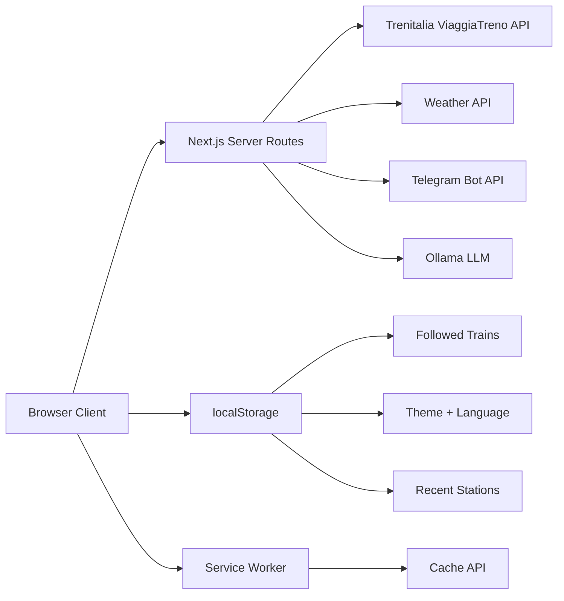

# 🚆 Treni Italia – Live Tracker

Real-time Italian train tracking webapp built with **Next.js 16**, **React 19**, and **TypeScript**.

> Track trains, plan journeys, follow delays — all in one modern, installable webapp.

---

## ✨ Features

### Core
- **Station Search** — Autocomplete via Trenitalia API with Ctrl+K shortcut
- **Departures / Arrivals Board** — Live data with delay highlighting and platform info
- **Train Route Timeline** — Full stop-by-stop journey with past/current/future indicators
- **Journey Planner** — A→B route search with date/time picker and multi-leg solutions
- **Delay Chart** — SVG bar chart showing delay per stop with configurable threshold line

### Smart Features
- **Follow Train** — Pin trains, background polling every 30s, browser notifications on station changes
- **Delay Notifications** — Configurable threshold with visual alerts + optional Telegram push
- **AI Assistant "Freccia Lenta"** 🐢 — NLP chatbot to search routes, follow trains, natural language interaction
- **Live News** — Real-time Trenitalia news feed
- **Weather Widget** — Current conditions with auto-refresh
- **Live Train Counter** — Real-time stats in the header

### Design & UX
- **Dark / Light Theme** — Toggle with CSS variable system, persisted in localStorage
- **10 Languages** — IT, EN, RO, AR, SQ, ZH, UK, FR, ES, DE
- **PWA** — Installable on mobile, works offline (service worker with cached API responses)
- **Responsive** — Desktop + mobile optimized
- **Glassmorphism** — Clean panel design with shimmer skeletons
- **Print-friendly** — Train timeline optimized for @media print
- **Accessibility** — ARIA labels, keyboard navigation, skip-to-content

### Upcoming (In Development)
- 🗺️ **Live Train Map** — Real-time map showing train position between stations using geolocation interpolation *(handled by team member)*
- 🔒 **Security Hardening** — CSP headers, rate limiting, input sanitization *(handled by team member)*

---

## 🏛️ Architecture

```
src/
├── app/
│   ├── api/                  # Server-side API proxies
│   │   ├── chat/             # AI chatbot (Ollama)
│   │   ├── news/             # Trenitalia news
│   │   ├── notify/telegram/  # Telegram push proxy
│   │   ├── search/           # A→B solutions
│   │   ├── stations/         # Station search + boards
│   │   ├── stats/            # Live train count
│   │   ├── trains/           # Train route data
│   │   └── weather/          # Weather data
│   ├── support/              # Customer support page
│   ├── layout.tsx            # Root layout + PWA
│   └── page.tsx              # Home (views: home/station/train)
├── components/
│   ├── SearchBox/            # Command palette search
│   ├── StationBoard/         # Departures/arrivals table
│   ├── TrainTimeline/        # Route timeline
│   ├── JourneyPlanner/       # A→B planner
│   ├── DelayChart/           # SVG delay chart
│   ├── WeatherWidget/        # Weather display
│   ├── NewsBanner/           # News feed
│   ├── Header/               # Nav + stats + theme toggle
│   ├── Chatbot/              # AI assistant
│   ├── TelegramSettings/     # Telegram config modal
│   └── FrecciaLenta.tsx      # Chatbot wrapper
├── context/
│   ├── ThemeContext.tsx       # Dark/light theme
│   ├── LocaleContext.tsx      # i18n with 10 locales
│   └── FollowedTrainsContext.tsx  # Train following + notifications
├── locales/                  # Translation JSON files
│   ├── it.json, en.json, ro.json, ar.json, sq.json
│   ├── zh.json, uk.json, fr.json, es.json, de.json
└── data/
    └── localNews.json        # Fallback news
```



---

## 🛠️ Tech Stack & Justification

| Technology | Why |
|---|---|
| **Next.js 16** | Server-side API routes as proxy (avoids CORS), SSR capabilities, built-in routing |
| **React 19** | Latest features, context-based state, hooks for async data |
| **TypeScript** | Type safety for API responses and component props |
| **CSS Modules** | Scoped styles, no runtime overhead, CSS variables for theming |
| **Service Worker** | Offline support, caching strategy (network-first for APIs) |
| **SVG** | Lightweight charts without library dependencies |
| **localStorage** | Client-side persistence without auth backend |

### Why a Proxy Architecture?

The Trenitalia API (`viaggiatreno.it`) does not support CORS. We proxy all requests through Next.js API routes:

```
Client → /api/stations/S01700 → viaggiatreno.it/infomobilita/resteasy/...
```

This also lets us transform data, cache responses, and add error handling server-side.

---

## 🚀 Getting Started

```bash
# Clone
git clone https://github.com/Kleo12345/treniItalia.git
cd treniItalia

# Install
npm install

# Run dev server
npm run dev
```

Open [http://localhost:3000](http://localhost:3000).

### PWA Installation

On mobile Chrome/Safari, tap "Add to Home Screen" to install as a native app.

---

## 📡 API Endpoints Used

| Endpoint | Purpose |
|---|---|
| `autocompletaStazione/{text}` | Station autocomplete |
| `partenze/{stationId}/{datetime}` | Departures board |
| `arrivi/{stationId}/{datetime}` | Arrivals board |
| `andamentoTreno/{origin}/{trainNum}` | Train route & stops |
| `cercaNumeroTrenoTrenoAutocomplete/{num}` | Find origin from train number |
| `soluzioniViaggioNew/{from}/{to}/{datetime}` | Journey solutions A→B |
| `statistiche/{timestamp}` | Live running train count |
| `news/0/it` | Trenitalia news |

Source: [sabas/trenitalia](https://github.com/sabas/trenitalia) API documentation.

---

## 🗺️ Live Map (Upcoming)

The live map feature will show the real-time position of trains between stations on an interactive map. The implementation approach:

1. **Station Coordinates** — Map station IDs to lat/lng using public datasets
2. **Position Interpolation** — Estimate current position between last-known station and next station using departure/arrival timestamps
3. **Map Rendering** — Leaflet.js / Mapbox with custom train markers
4. **Route Lines** — Actual rail paths from OpenStreetMap railway data
5. **Real-time Updates** — Polling train position and animating movement along the route

This feature is being developed by a team member and will integrate with the existing `TrainTimeline` component's stop data.


## 📄 License

School project — educational use.
